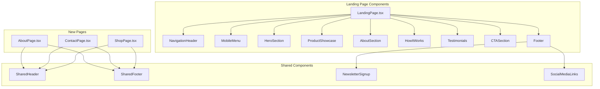

# Design Document: Landing Page Improvements

## Overview

This design document outlines the technical implementation for improving the Vali Produce landing page. The improvements include fixing broken navigation links, implementing a sticky header with mobile menu, creating new pages (About, Contact), adding a product showcase section, and enhancing the footer with social links and newsletter signup.

The implementation uses the existing React + TypeScript + Tailwind CSS stack with shadcn/ui components.

## Architecture



## Components and Interfaces

### 1. NavigationHeader Component

```typescript
interface NavigationHeaderProps {
  isSticky?: boolean;
  onMobileMenuToggle: () => void;
  isMobileMenuOpen: boolean;
}

interface NavLink {
  label: string;
  href: string;
  isExternal?: boolean;
}
```

**Behavior:**
- Monitors scroll position using `useEffect` and `useState`
- Applies sticky positioning when scroll > 100px
- Shows/hides mobile menu button based on viewport width
- Contains logo, contact info, nav links, and auth buttons

### 2. MobileMenu Component

```typescript
interface MobileMenuProps {
  isOpen: boolean;
  onClose: () => void;
  navLinks: NavLink[];
}
```

**Behavior:**
- Slides in from right side on mobile
- Locks body scroll when open
- Closes on outside click, close button, or navigation
- Contains all nav links plus auth buttons

### 3. ProductShowcase Component

```typescript
interface ProductCategory {
  id: string;
  name: string;
  description: string;
  image: string;
  slug: string;
}

interface ProductShowcaseProps {
  categories?: ProductCategory[];
  isLoading?: boolean;
  error?: string | null;
  onRetry?: () => void;
}
```

**Behavior:**
- Fetches product categories from API or uses static data
- Displays loading skeletons during fetch
- Shows error state with retry button on failure
- Navigates to filtered product list on card click

### 4. ContactForm Component

```typescript
interface ContactFormData {
  name: string;
  email: string;
  phone: string;
  message: string;
}

interface ContactFormProps {
  onSubmit: (data: ContactFormData) => Promise<void>;
  isSubmitting?: boolean;
}
```

**Validation Rules:**
- Name: Required, min 2 characters
- Email: Required, valid email format
- Phone: Optional, valid phone format if provided
- Message: Required, min 10 characters

### 5. NewsletterSignup Component

```typescript
interface NewsletterSignupProps {
  onSubscribe: (email: string) => Promise<void>;
  isSubmitting?: boolean;
}
```

**Behavior:**
- Validates email format before submission
- Shows success/error toast messages
- Clears input on successful subscription

## Data Models

### Navigation Links Configuration

```typescript
const NAV_LINKS: NavLink[] = [
  { label: 'Home', href: '/' },
  { label: 'Products', href: '/shop' },
  { label: 'About', href: '/about' },
  { label: 'Contact', href: '/contact' },
];

const SOCIAL_LINKS = [
  { platform: 'facebook', url: 'https://facebook.com/valiproduce', icon: Facebook },
  { platform: 'instagram', url: 'https://instagram.com/valiproduce', icon: Instagram },
  { platform: 'twitter', url: 'https://twitter.com/valiproduce', icon: Twitter },
];
```

### Product Categories (Static Data)

```typescript
const PRODUCT_CATEGORIES: ProductCategory[] = [
  { id: '1', name: 'Fresh Vegetables', description: 'Farm-fresh vegetables daily', image: '/categories/vegetables.jpg', slug: 'vegetables' },
  { id: '2', name: 'Fresh Fruits', description: 'Seasonal fruits from local farms', image: '/categories/fruits.jpg', slug: 'fruits' },
  { id: '3', name: 'Leafy Greens', description: 'Organic leafy greens', image: '/categories/greens.jpg', slug: 'greens' },
  { id: '4', name: 'Root Vegetables', description: 'Potatoes, carrots, and more', image: '/categories/roots.jpg', slug: 'roots' },
  { id: '5', name: 'Herbs & Spices', description: 'Fresh herbs for your kitchen', image: '/categories/herbs.jpg', slug: 'herbs' },
  { id: '6', name: 'Organic Produce', description: 'Certified organic selection', image: '/categories/organic.jpg', slug: 'organic' },
];
```

## Correctness Properties

*A property is a characteristic or behavior that should hold true across all valid executions of a system-essentially, a formal statement about what the system should do. Properties serve as the bridge between human-readable specifications and machine-verifiable correctness guarantees.*

### Property 1: Sticky Header State Consistency

*For any* scroll position value, the navigation header sticky state SHALL be true if and only if scroll position exceeds the threshold (100px), and the shadow class SHALL be applied if and only if sticky state is true.

**Validates: Requirements 2.1, 2.2, 2.3**

### Property 2: Responsive Navigation Display

*For any* viewport width, the hamburger menu icon SHALL be visible if and only if viewport width is less than 768 pixels, and full navigation links SHALL be visible if and only if viewport width is greater than or equal to 768 pixels.

**Validates: Requirements 3.1**

### Property 3: Product Card Content Completeness

*For any* product category data rendered in the Product_Showcase, the resulting card element SHALL contain the category name, an image element, and a description text.

**Validates: Requirements 5.1, 5.2**

### Property 4: Contact Form Validation

*For any* contact form input combination, if any required field is empty or any field fails format validation, the form SHALL display appropriate error messages and prevent submission.

**Validates: Requirements 7.3**

### Property 5: Email Format Validation

*For any* string input to the newsletter signup, the validation function SHALL return true if and only if the string matches a valid email format pattern.

**Validates: Requirements 8.3**

## Error Handling

### Network Errors
- Product showcase: Display error message with retry button
- Contact form: Show toast with error message, preserve form data
- Newsletter: Show inline error message with retry option

### Validation Errors
- Contact form: Display field-specific error messages below each input
- Newsletter: Display inline error for invalid email format

### Navigation Errors
- 404 handling: Redirect to NotFound page for invalid routes
- Auth redirect: Redirect unauthenticated users appropriately

## Testing Strategy

### Property-Based Testing

We will use **fast-check** library for property-based testing in TypeScript/React.

**Configuration:**
- Minimum 100 iterations per property test
- Tests tagged with property reference comments

**Properties to Test:**
1. Sticky header state based on scroll position
2. Responsive breakpoint behavior
3. Product card rendering completeness
4. Form validation logic
5. Email validation function

### Unit Tests

- Navigation link rendering and click handlers
- Mobile menu open/close state management
- Form field validation functions
- Component rendering with various props

### Integration Tests

- Full page navigation flow
- Form submission success/error flows
- Responsive layout transitions

## File Structure

```
clinet/src/
├── components/
│   └── landing/
│       ├── NavigationHeader.tsx
│       ├── MobileMenu.tsx
│       ├── ProductShowcase.tsx
│       ├── NewsletterSignup.tsx
│       └── SocialMediaLinks.tsx
├── pages/
│   ├── LandingPage.tsx (updated)
│   ├── AboutPage.tsx (new)
│   ├── ContactPage.tsx (new)
│   └── ShopPage.tsx (new)
├── utils/
│   └── validation.ts
└── data/
    └── landingPageData.ts
```
