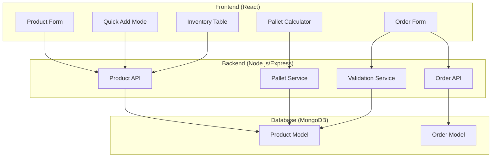

# Design Document: Product Sales & Pallet Tracking

## Overview

This design enhances the product management system with simplified product creation, flexible sales unit configuration, and smart pallet tracking calculations. The system will help admins manage inventory more efficiently while providing accurate shipping estimates.

**Important Disclaimer:** All pallet calculations are estimates for planning purposes only. Actual pallet configurations depend on real-world factors like case shape, stacking stability, and warehouse conditions.

## Architecture



## Components and Interfaces

### 1. Product Model Extensions

```javascript
// New fields to add to productModel.js
{
  // Sales configuration
  salesMode: {
    type: String,
    enum: ["unit", "case", "both"],
    default: "both"
  },
  
  // Case dimensions (in inches)
  caseDimensions: {
    length: { type: Number, default: 0 },
    width: { type: Number, default: 0 },
    height: { type: Number, default: 0 }
  },
  
  // Case weight in lbs
  caseWeight: {
    type: Number,
    default: 0
  },
  
  // Calculated pallet capacity (updated on save)
  palletCapacity: {
    casesPerLayer: { type: Number, default: 0 },
    layersPerPallet: { type: Number, default: 0 },
    totalCasesPerPallet: { type: Number, default: 0 },
    isEstimate: { type: Boolean, default: true }
  }
}
```

### 2. Pallet Calculation Service

```javascript
// server/utils/palletCalculator.js

const STANDARD_PALLET = {
  length: 48,  // inches
  width: 40,   // inches
  maxHeight: 48, // inches (stack height)
  maxWeight: 2500 // lbs
};

/**
 * Calculate pallet capacity for a product
 * @param {Object} caseDimensions - {length, width, height} in inches
 * @param {Number} caseWeight - weight per case in lbs
 * @returns {Object} - pallet capacity estimates
 */
function calculatePalletCapacity(caseDimensions, caseWeight) {
  const { length, width, height } = caseDimensions;
  
  // Validate dimensions
  if (!length || !width || !height || length <= 0 || width <= 0 || height <= 0) {
    return null;
  }
  
  // Calculate cases per layer (try both orientations)
  const orientation1 = Math.floor(STANDARD_PALLET.length / length) * 
                       Math.floor(STANDARD_PALLET.width / width);
  const orientation2 = Math.floor(STANDARD_PALLET.length / width) * 
                       Math.floor(STANDARD_PALLET.width / length);
  
  const casesPerLayer = Math.max(orientation1, orientation2);
  
  // Calculate layers based on height
  const layersByHeight = Math.floor(STANDARD_PALLET.maxHeight / height);
  
  // Calculate layers based on weight (if caseWeight provided)
  let layersByWeight = layersByHeight;
  if (caseWeight > 0) {
    const maxCasesByWeight = Math.floor(STANDARD_PALLET.maxWeight / caseWeight);
    layersByWeight = Math.floor(maxCasesByWeight / casesPerLayer);
  }
  
  // Use the more restrictive limit
  const layersPerPallet = Math.min(layersByHeight, layersByWeight);
  const totalCasesPerPallet = casesPerLayer * layersPerPallet;
  
  return {
    casesPerLayer,
    layersPerPallet,
    totalCasesPerPallet,
    isEstimate: true,
    constraints: {
      limitedBy: layersByWeight < layersByHeight ? 'weight' : 'height',
      palletDimensions: STANDARD_PALLET
    }
  };
}

/**
 * Calculate pallets needed for a quantity
 * @param {Number} quantity - number of cases
 * @param {Number} casesPerPallet - cases that fit on one pallet
 * @returns {Object} - pallet count and remainder
 */
function calculatePalletsNeeded(quantity, casesPerPallet) {
  if (!casesPerPallet || casesPerPallet <= 0) return null;
  
  const fullPallets = Math.floor(quantity / casesPerPallet);
  const remainder = quantity % casesPerPallet;
  const totalPallets = remainder > 0 ? fullPallets + 1 : fullPallets;
  
  return {
    fullPallets,
    partialPalletCases: remainder,
    totalPallets,
    utilizationPercent: ((quantity / (totalPallets * casesPerPallet)) * 100).toFixed(1)
  };
}
```

### 3. Order Validation Service

```javascript
// server/utils/orderValidation.js

/**
 * Validate order item based on product's salesMode
 * @param {Object} product - product document
 * @param {Object} orderItem - {quantity, pricingType}
 * @returns {Object} - {valid, error}
 */
function validateOrderItem(product, orderItem) {
  const { salesMode } = product;
  const { quantity, pricingType } = orderItem;
  
  // Case-only products must have integer quantities
  if (salesMode === 'case') {
    if (pricingType === 'unit') {
      return { valid: false, error: 'This product can only be ordered by case' };
    }
    if (!Number.isInteger(quantity) || quantity < 1) {
      return { valid: false, error: 'Case quantity must be a whole number (1 or more)' };
    }
  }
  
  // Unit-only products
  if (salesMode === 'unit') {
    if (pricingType === 'box') {
      return { valid: false, error: 'This product can only be ordered by unit' };
    }
    if (quantity <= 0) {
      return { valid: false, error: 'Quantity must be greater than 0' };
    }
  }
  
  // Both mode - validate based on selected pricing type
  if (salesMode === 'both') {
    if (pricingType === 'box' && (!Number.isInteger(quantity) || quantity < 1)) {
      return { valid: false, error: 'Case quantity must be a whole number' };
    }
    if (quantity <= 0) {
      return { valid: false, error: 'Quantity must be greater than 0' };
    }
  }
  
  return { valid: true };
}
```

### 4. Frontend Components

#### Quick Add Product Form
```typescript
// Simplified form with only essential fields
interface QuickAddFormData {
  name: string;           // Required
  category: string;       // Required
  price: number;          // Required (unit price)
  pricePerBox: number;    // Optional
  boxSize: number;        // Optional
  salesMode: 'unit' | 'case' | 'both';  // Default: 'both'
}
```

#### Sales Mode Selector Component
```typescript
interface SalesModeProps {
  value: 'unit' | 'case' | 'both';
  onChange: (mode: 'unit' | 'case' | 'both') => void;
  disabled?: boolean;
}
```

#### Pallet Estimate Display Component
```typescript
interface PalletEstimateProps {
  caseDimensions: { length: number; width: number; height: number };
  caseWeight: number;
  currentStock: number;  // in cases
  showBreakdown?: boolean;
}
```

## Data Models

### Updated Product Schema

```javascript
const ProductSchema = new mongoose.Schema({
  // Existing fields...
  name: { type: String, required: true, trim: true },
  category: { type: mongoose.Schema.Types.ObjectId, ref: "Category", required: true },
  price: { type: Number, required: true, default: 0 },
  
  // NEW: Sales mode configuration
  salesMode: {
    type: String,
    enum: ["unit", "case", "both"],
    default: "both"
  },
  
  // NEW: Case dimensions for pallet calculation
  caseDimensions: {
    length: { type: Number, default: 0, min: 0 },
    width: { type: Number, default: 0, min: 0 },
    height: { type: Number, default: 0, min: 0 }
  },
  
  // NEW: Case weight
  caseWeight: { type: Number, default: 0, min: 0 },
  
  // NEW: Cached pallet capacity (recalculated on dimension change)
  palletCapacity: {
    casesPerLayer: { type: Number, default: 0 },
    layersPerPallet: { type: Number, default: 0 },
    totalCasesPerPallet: { type: Number, default: 0 }
  },
  
  // Existing fields continue...
  boxSize: { type: Number, default: 0 },
  pricePerBox: { type: Number, default: 0 },
  // ... rest of existing schema
});

// Pre-save hook to calculate pallet capacity
ProductSchema.pre('save', function(next) {
  if (this.isModified('caseDimensions') || this.isModified('caseWeight')) {
    const capacity = calculatePalletCapacity(this.caseDimensions, this.caseWeight);
    if (capacity) {
      this.palletCapacity = {
        casesPerLayer: capacity.casesPerLayer,
        layersPerPallet: capacity.layersPerPallet,
        totalCasesPerPallet: capacity.totalCasesPerPallet
      };
    }
  }
  next();
});
```

### Order Item Validation

```javascript
// In order creation/update
const orderItemSchema = {
  productId: { type: mongoose.Schema.Types.ObjectId, ref: 'Product' },
  quantity: { type: Number, required: true },
  pricingType: { type: String, enum: ['unit', 'box'], required: true },
  // ... existing fields
};
```

## Correctness Properties

*A property is a characteristic or behavior that should hold true across all valid executions of a system—essentially, a formal statement about what the system should do. Properties serve as the bridge between human-readable specifications and machine-verifiable correctness guarantees.*

### Property 1: Product Creation with Defaults
*For any* product created with only required fields (name, category, price), the system shall successfully create the product with salesMode defaulting to "both" and all optional fields set to their default values.
**Validates: Requirements 1.1, 1.2**

### Property 2: SalesMode Validation
*For any* product, the salesMode field shall only accept values "unit", "case", or "both". Any other value shall be rejected.
**Validates: Requirements 2.1**

### Property 3: Case-Only Ordering Constraint
*For any* product with salesMode="case" and any order attempt, the order shall only succeed if the quantity is a positive integer and pricingType is "box". Non-integer quantities or unit pricing shall be rejected.
**Validates: Requirements 2.2, 2.6**

### Property 4: Unit-Mode Decimal Quantities
*For any* product with salesMode="unit" and any positive decimal quantity, the order shall be accepted when pricingType is "unit".
**Validates: Requirements 2.3, 4.5**

### Property 5: Both-Mode Flexibility
*For any* product with salesMode="both", orders shall succeed with either pricingType ("unit" or "box") as long as case orders use integer quantities and unit orders use positive quantities.
**Validates: Requirements 2.4**

### Property 6: Case Dimensions Validation
*For any* product with case dimensions, all dimension values (length, width, height) and caseWeight must be non-negative numbers. The system shall reject negative values.
**Validates: Requirements 3.1, 3.2**

### Property 7: Cases Per Layer Calculation
*For any* product with valid positive case dimensions, the calculated casesPerLayer shall equal the maximum of: floor(48/length) × floor(40/width) OR floor(48/width) × floor(40/length), representing optimal case orientation on a 48"×40" pallet.
**Validates: Requirements 3.3, 3.5**

### Property 8: Total Cases Per Pallet Calculation
*For any* product with valid case dimensions and weight, the totalCasesPerPallet shall be casesPerLayer × layersPerPallet, where layersPerPallet is the minimum of: floor(48/height) and floor(2500/(caseWeight × casesPerLayer)).
**Validates: Requirements 3.4, 3.5**

### Property 9: Pallet Count for Orders
*For any* order quantity Q and product with totalCasesPerPallet P (where P > 0), the estimated pallet count shall equal ceil(Q / P).
**Validates: Requirements 3.7**

### Property 10: Inventory Pallet Estimate
*For any* product with current stock S cases and totalCasesPerPallet P (where P > 0), the inventory pallet estimate shall equal ceil(S / P).
**Validates: Requirements 3.8**

### Property 11: Total Pallets Aggregation
*For any* set of products with pallet estimates, the total estimated pallets shall equal the sum of individual product pallet estimates.
**Validates: Requirements 5.5**

### Property 12: Filtered Pallet Calculation
*For any* category filter applied to inventory, the displayed total pallet estimate shall equal the sum of pallet estimates only for products matching the filter criteria.
**Validates: Requirements 5.6**

## Error Handling

| Error Scenario | Response | User Message |
|----------------|----------|--------------|
| Missing required fields (name, category, price) | 400 Bad Request | "Please fill in all required fields: name, category, and price" |
| Invalid salesMode value | 400 Bad Request | "Sales mode must be 'unit', 'case', or 'both'" |
| Non-integer quantity for case-only product | 400 Bad Request | "This product can only be ordered in whole cases" |
| Unit order for case-only product | 400 Bad Request | "This product is sold by case only" |
| Negative case dimensions | 400 Bad Request | "Case dimensions must be positive numbers" |
| Missing dimensions for pallet calc | N/A (graceful) | Display "Dimensions required for pallet calculation" |
| Zero cases per pallet (invalid dimensions) | N/A (graceful) | Display "Unable to calculate - check dimensions" |

## Testing Strategy

### Unit Tests
- Test pallet calculation with various case dimensions
- Test order validation for each salesMode
- Test default value assignment on product creation
- Test edge cases: zero dimensions, very large dimensions, heavy cases

### Property-Based Tests
Using a property-based testing library (e.g., fast-check for JavaScript):

1. **Product Creation Property Test**
   - Generate random products with only required fields
   - Verify defaults are applied correctly
   - Minimum 100 iterations

2. **SalesMode Validation Property Test**
   - Generate random salesMode values
   - Verify only valid values are accepted
   - Minimum 100 iterations

3. **Case-Only Ordering Property Test**
   - Generate random quantities (integers and decimals)
   - Verify integer quantities succeed, decimals fail for case-only
   - Minimum 100 iterations

4. **Pallet Calculation Property Test**
   - Generate random valid dimensions
   - Verify calculation formula produces expected results
   - Verify weight limits are respected
   - Minimum 100 iterations

5. **Pallet Count Property Test**
   - Generate random quantities and pallet capacities
   - Verify ceil(quantity/capacity) formula
   - Minimum 100 iterations

### Integration Tests
- End-to-end product creation with pallet calculation
- Order creation with salesMode validation
- Inventory display with pallet estimates
