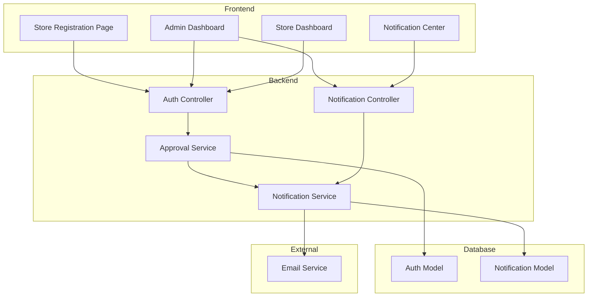

# Design Document: Store Approval & Notifications System

## Overview

This design implements a store registration approval workflow with comprehensive notifications. The system extends the existing authentication model to include approval status tracking and introduces a notification service for email and in-app communications across key business events.

The architecture follows the existing patterns in the codebase:
- Backend: Node.js/Express with MongoDB (Mongoose)
- Frontend: React with TypeScript, Redux for state management
- Email: Nodemailer with existing mailSender utility

## Architecture



## Components and Interfaces

### 1. Auth Model Extensions

Extend the existing `authModel.js` to include approval workflow fields:

```javascript
// Additional fields for authSchema
{
  approvalStatus: {
    type: String,
    enum: ["pending", "approved", "rejected"],
    default: "pending"
  },
  registrationRef: {
    type: String,
    unique: true,
    sparse: true
  },
  approvedAt: {
    type: Date
  },
  approvedBy: {
    type: mongoose.Schema.Types.ObjectId,
    ref: "auth"
  },
  rejectedAt: {
    type: Date
  },
  rejectedBy: {
    type: mongoose.Schema.Types.ObjectId,
    ref: "auth"
  },
  rejectionReason: {
    type: String,
    trim: true
  }
}
```

### 2. Notification Model

New model for storing notifications:

```javascript
// server/models/notificationModel.js
const notificationSchema = new mongoose.Schema({
  recipient: {
    type: mongoose.Schema.Types.ObjectId,
    ref: "auth",
    required: true
  },
  type: {
    type: String,
    enum: [
      "store_registration",
      "store_approved", 
      "store_rejected",
      "order_created",
      "order_status_changed",
      "payment_reminder",
      "inactivity_alert",
      "system"
    ],
    required: true
  },
  title: {
    type: String,
    required: true
  },
  message: {
    type: String,
    required: true
  },
  data: {
    type: mongoose.Schema.Types.Mixed
  },
  isRead: {
    type: Boolean,
    default: false
  },
  readAt: {
    type: Date
  },
  emailSent: {
    type: Boolean,
    default: false
  },
  emailSentAt: {
    type: Date
  },
  link: {
    type: String
  }
}, { timestamps: true });
```

### 3. Notification Service

Core service for handling all notifications:

```javascript
// server/services/notificationService.js
class NotificationService {
  async createNotification(recipientId, type, title, message, data, link)
  async sendEmailNotification(email, subject, template, data)
  async notifyAdmins(type, title, message, data, link)
  async markAsRead(notificationId, userId)
  async getUnreadCount(userId)
  async getUserNotifications(userId, filters)
}
```

### 4. API Endpoints

#### Auth Controller Extensions

```
POST   /api/auth/register          - Modified to set pending status & send notifications
POST   /api/auth/approve/:id       - Admin approves store
POST   /api/auth/reject/:id        - Admin rejects store  
GET    /api/auth/pending-stores    - Get all pending registrations
```

#### Notification Controller

```
GET    /api/notifications          - Get user's notifications
GET    /api/notifications/unread   - Get unread count
PUT    /api/notifications/:id/read - Mark notification as read
PUT    /api/notifications/read-all - Mark all as read
DELETE /api/notifications/:id      - Delete notification
```

### 5. Frontend Components

#### PendingApprovalPage Component
- Displayed to stores with "pending" status after login
- Shows registration status and expected timeline
- Contact information for support

#### AdminApprovalDashboard Component
- Table of pending store registrations
- Approve/Reject actions with confirmation dialogs
- Rejection reason input modal

#### NotificationCenter Component
- Bell icon with unread badge in navbar
- Dropdown/panel showing recent notifications
- Full notification list page with filters

#### NotificationBadge Component
- Real-time unread count display
- Polling or WebSocket for updates

## Data Models

### Notification Types Enum

```typescript
type NotificationType = 
  | "store_registration"    // New store registered (to admins)
  | "store_approved"        // Store approved (to store)
  | "store_rejected"        // Store rejected (to store)
  | "order_created"         // New order placed (to store & admins)
  | "order_status_changed"  // Order status update (to store)
  | "payment_reminder"      // Payment due reminder (to store)
  | "inactivity_alert"      // Store inactive (to admins)
  | "system"                // System notifications
```

### Email Templates

```typescript
interface EmailTemplate {
  subject: string;
  htmlTemplate: (data: any) => string;
}

const templates = {
  REGISTRATION_CONFIRMATION: EmailTemplate,
  REGISTRATION_ADMIN_ALERT: EmailTemplate,
  STORE_APPROVED: EmailTemplate,
  STORE_REJECTED: EmailTemplate,
  ORDER_CONFIRMATION: EmailTemplate,
  ORDER_STATUS_UPDATE: EmailTemplate,
  PAYMENT_REMINDER: EmailTemplate
}
```

## Correctness Properties

*A property is a characteristic or behavior that should hold true across all valid executions of a system-essentially, a formal statement about what the system should do. Properties serve as the bridge between human-readable specifications and machine-verifiable correctness guarantees.*

### Property 1: Registration Creates Pending Status with Unique Reference

*For any* valid store registration request, the created store record SHALL have approval_status set to "pending" and a unique registration reference number that does not exist in any other store record.

**Validates: Requirements 1.1, 1.2**

### Property 2: Duplicate Email Prevention

*For any* registration attempt with an email that already exists in the system, the registration SHALL be rejected with an error, and no new store record SHALL be created.

**Validates: Requirements 1.5**

### Property 3: Registration Triggers Dual Notifications

*For any* successful store registration, exactly two notifications SHALL be created: one confirmation email to the store owner containing registration details, and one alert notification to all admin users about the new registration request.

**Validates: Requirements 1.3, 1.4**

### Property 4: Approval Status Transition Integrity

*For any* store with "pending" status, an approval action SHALL transition the status to "approved" with approvedAt timestamp, and a rejection action SHALL transition the status to "rejected" with rejectionReason stored. No other transitions are valid.

**Validates: Requirements 2.3, 2.4**

### Property 5: Approval Decision Notification

*For any* approval or rejection action by an admin, exactly one notification SHALL be sent to the store owner containing the decision outcome and relevant details (welcome info for approval, rejection reason for rejection).

**Validates: Requirements 2.5, 3.4**

### Property 6: Access Control Based on Approval Status

*For any* store login attempt, the access level returned SHALL be determined by approval_status: "pending" returns limited access flag, "approved" returns full access flag, "rejected" returns login denied with rejection reason.

**Validates: Requirements 3.1, 3.2, 3.3**

### Property 7: Order Events Create Notifications

*For any* purchase order creation or status change event, the system SHALL create a notification to the store owner with order details, and for creation events, also create an in-app notification to admin users.

**Validates: Requirements 4.1, 4.2, 4.3**

### Property 8: Pending Stores List Completeness and Ordering

*For any* request to the pending stores endpoint, the response SHALL contain all and only stores with approval_status "pending", sorted by createdAt in ascending order, with all required fields (storeName, ownerName, email, phone, address, createdAt) present.

**Validates: Requirements 2.1, 2.2**

### Property 9: Notification Read State Consistency

*For any* notification marked as read, the isRead field SHALL be true and readAt SHALL contain a valid timestamp that is greater than or equal to the notification's createdAt timestamp.

**Validates: Requirements 7.3**

### Property 10: Notification Filtering Accuracy

*For any* notification query with type filter, the returned notifications SHALL contain only notifications matching the specified type(s), and the unread count SHALL equal the count of notifications where isRead is false.

**Validates: Requirements 7.2, 7.4**

### Property 11: Notification Template Selection

*For any* notification of a given type, the email sent SHALL use the template corresponding to that notification type, and a notification record SHALL be persisted in the database for audit purposes.

**Validates: Requirements 6.3, 6.4**

## Error Handling

### Registration Errors
- Duplicate email: Return 400 with clear message
- Invalid data: Return 400 with validation errors
- Email send failure: Log error, continue registration (non-blocking)

### Approval Errors
- Store not found: Return 404
- Already approved/rejected: Return 400 with current status
- Unauthorized: Return 403

### Notification Errors
- Email delivery failure: Retry up to 3 times, log failure
- Database write failure: Log error, return 500
- Invalid recipient: Skip notification, log warning

## Testing Strategy

### Unit Tests
- Registration reference number generation uniqueness
- Approval status transition validation
- Email template rendering
- Notification filtering logic

### Property-Based Tests
- Use fast-check library for TypeScript
- Minimum 100 iterations per property test
- Test data generators for stores, notifications, and approval actions

### Integration Tests
- Full registration → approval → login flow
- Notification delivery end-to-end
- Admin dashboard data accuracy

### Test Configuration
```javascript
// Property test configuration
{
  numRuns: 100,
  seed: Date.now(),
  verbose: true
}
```

Each property test will be tagged with:
**Feature: store-approval-notifications, Property {number}: {property_text}**
