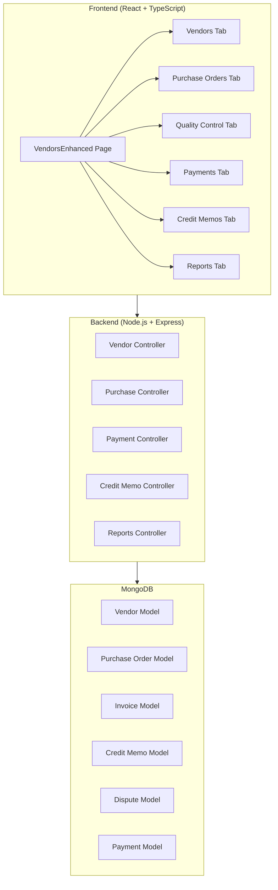

# Design Document: Vendor Management System

## Overview

This design document outlines the architecture and implementation approach for a comprehensive Vendor Management System tailored for the produce industry. The system extends the existing vendor and purchase order functionality to include payment terms management, three-way matching, credit/debit memos, vendor performance scorecards, aging reports, and produce-specific features like weight-based pricing and quality rejection reasons.

The implementation follows the existing patterns in the codebase (React + TypeScript frontend with shadcn/ui components, Node.js/Express backend with MongoDB) and enhances the current `VendorsEnhanced.tsx` page with additional tabs and functionality.

## Architecture



## Components and Interfaces

### Frontend Components

#### 1. Enhanced Vendor Management Page (`VendorsEnhanced.tsx`)

The main page will be restructured with the following tabs:
- **Dashboard** - Overview stats, KPIs, alerts
- **Vendors** - Vendor list with enhanced profiles
- **Purchase Orders** - PO management with receiving
- **Quality Control** - Quality inspection workflow
- **Invoices** - Invoice upload and three-way matching
- **Credit Memos** - Credit/debit memo management
- **Payments** - Payment recording and history
- **Reports** - Aging, statements, scorecards

#### 2. Component Structure

```typescript
// Vendor Profile with Payment Terms
interface VendorProfile {
  _id: string;
  name: string;
  type: 'farmer' | 'supplier' | 'distributor' | 'other';
  contactName: string;
  email: string;
  phone: string;
  address: string;
  status: 'active' | 'inactive' | 'on_hold' | 'blacklisted';
  statusReason?: string;
  paymentTerms: {
    type: 'cod' | 'net15' | 'net30' | 'net45' | 'net60' | 'custom';
    customDays?: number;
    earlyPaymentDiscount?: {
      percentage: number;
      withinDays: number;
    };
  };
  productsSupplied: string[];
  notes: string;
  // Calculated fields
  totalPurchases: number;
  totalPaid: number;
  outstandingBalance: number;
  averagePaymentDays: number;
  performanceScore: {
    onTimeDeliveryRate: number;
    qualityAcceptanceRate: number;
    fillRate: number;
  };
}

// Enhanced Purchase Order
interface PurchaseOrder {
  _id: string;
  purchaseOrderNumber: string;
  vendorId: string;
  status: 'draft' | 'sent' | 'partially_received' | 'fully_received' | 'closed' | 'cancelled';
  purchaseDate: Date;
  expectedDeliveryDate: Date;
  actualDeliveryDate?: Date;
  items: PurchaseOrderItem[];
  totalAmount: number;
  receivedAmount: number;
  invoicedAmount: number;
  notes: string;
  paymentStatus: 'pending' | 'partial' | 'paid';
  paymentAmount: number;
}

interface PurchaseOrderItem {
  _id: string;
  productId: string;
  productName: string;
  orderedQuantity: number;
  receivedQuantity: number;
  approvedQuantity: number;
  rejectedQuantity: number;
  unitPrice: number;
  totalPrice: number;
  unit: string;
  lb?: number;
  totalWeight?: number;
  qualityStatus: 'pending' | 'approved' | 'rejected' | 'partial';
  qualityNotes?: string;
  rejectionReason?: string;
  mediaUrls: string[];
  lotNumber?: string;
  expirationDate?: Date;
}

// Invoice with Three-Way Matching
interface VendorInvoice {
  _id: string;
  invoiceNumber: string;
  vendorId: string;
  linkedPurchaseOrders: string[];
  invoiceDate: Date;
  dueDate: Date;
  totalAmount: number;
  status: 'pending' | 'matched' | 'disputed' | 'approved' | 'paid';
  matchingStatus: {
    poMatch: boolean;
    receivingMatch: boolean;
    priceMatch: boolean;
    varianceAmount: number;
    variancePercentage: number;
  };
  disputeReason?: string;
  approvalRequired: boolean;
  approvedBy?: string;
  approvedAt?: Date;
  documentUrl?: string;
}

// Credit/Debit Memo
interface CreditMemo {
  _id: string;
  memoNumber: string;
  type: 'credit' | 'debit';
  vendorId: string;
  linkedPurchaseOrderId?: string;
  linkedInvoiceId?: string;
  reasonCategory: 'quality_issue' | 'short_shipment' | 'price_correction' | 'return' | 'other';
  description: string;
  amount: number;
  status: 'draft' | 'pending_approval' | 'approved' | 'applied' | 'voided';
  appliedToPaymentId?: string;
  createdAt: Date;
  approvedBy?: string;
  approvedAt?: Date;
}

// Payment Record
interface VendorPayment {
  _id: string;
  paymentNumber: string;
  vendorId: string;
  invoiceIds: string[];
  amount: number;
  method: 'cash' | 'check' | 'credit_card' | 'ach' | 'wire';
  checkNumber?: string;
  checkClearanceStatus?: 'pending' | 'cleared' | 'bounced';
  transactionId?: string;
  appliedCredits: {
    creditMemoId: string;
    amount: number;
  }[];
  earlyPaymentDiscountTaken: number;
  paymentDate: Date;
  notes: string;
}

// Dispute
interface VendorDispute {
  _id: string;
  disputeNumber: string;
  vendorId: string;
  linkedPurchaseOrderId?: string;
  linkedInvoiceId?: string;
  type: 'quality' | 'quantity' | 'pricing' | 'delivery' | 'other';
  description: string;
  status: 'open' | 'in_progress' | 'resolved' | 'escalated' | 'closed';
  putInvoicesOnHold: boolean;
  communications: {
    date: Date;
    message: string;
    by: string;
  }[];
  resolution?: {
    notes: string;
    creditMemoId?: string;
    resolvedAt: Date;
    resolvedBy: string;
  };
}
```

### Backend API Endpoints

#### Vendor Endpoints (Enhanced)
- `PUT /api/vendors/:id/payment-terms` - Update vendor payment terms
- `PUT /api/vendors/:id/status` - Update vendor status with reason
- `GET /api/vendors/:id/performance` - Get vendor performance scorecard
- `GET /api/vendors/:id/statement` - Generate vendor statement

#### Invoice Endpoints (New)
- `POST /api/invoices` - Create/upload vendor invoice
- `GET /api/invoices` - List invoices with filters
- `GET /api/invoices/:id` - Get invoice details
- `PUT /api/invoices/:id/match` - Perform three-way matching
- `PUT /api/invoices/:id/approve` - Approve invoice for payment
- `PUT /api/invoices/:id/dispute` - Mark invoice as disputed

#### Credit Memo Endpoints (New)
- `POST /api/credit-memos` - Create credit/debit memo
- `GET /api/credit-memos` - List memos with filters
- `PUT /api/credit-memos/:id/approve` - Approve memo
- `PUT /api/credit-memos/:id/apply` - Apply memo to payment
- `GET /api/vendors/:id/unapplied-credits` - Get unapplied credits

#### Payment Endpoints (Enhanced)
- `POST /api/vendor-payments` - Record vendor payment
- `GET /api/vendor-payments` - List payments with filters
- `PUT /api/vendor-payments/:id/check-status` - Update check clearance

#### Report Endpoints (New)
- `GET /api/reports/aging` - Vendor aging report
- `GET /api/reports/vendor-comparison` - Compare vendors
- `GET /api/reports/disputes-summary` - Dispute summary

#### Dispute Endpoints (New)
- `POST /api/disputes` - Create dispute
- `GET /api/disputes` - List disputes
- `PUT /api/disputes/:id/status` - Update dispute status
- `POST /api/disputes/:id/communication` - Add communication
- `PUT /api/disputes/:id/resolve` - Resolve dispute

## Data Models

### Enhanced Vendor Model

```javascript
const vendorSchema = new mongoose.Schema({
  name: { type: String, required: true },
  type: { type: String, enum: ['farmer', 'supplier', 'distributor', 'other'], default: 'supplier' },
  contactName: String,
  email: String,
  phone: String,
  address: String,
  status: { type: String, enum: ['active', 'inactive', 'on_hold', 'blacklisted'], default: 'active' },
  statusReason: String,
  statusChangedAt: Date,
  paymentTerms: {
    type: { type: String, enum: ['cod', 'net15', 'net30', 'net45', 'net60', 'custom'], default: 'net30' },
    customDays: Number,
    earlyPaymentDiscount: {
      percentage: Number,
      withinDays: Number
    }
  },
  productsSupplied: [String],
  notes: String,
  performanceThresholds: {
    minOnTimeDeliveryRate: { type: Number, default: 90 },
    minQualityAcceptanceRate: { type: Number, default: 95 },
    minFillRate: { type: Number, default: 95 }
  }
}, { timestamps: true });
```

### Invoice Model (New)

```javascript
const invoiceSchema = new mongoose.Schema({
  invoiceNumber: { type: String, required: true, unique: true },
  vendorId: { type: mongoose.Schema.Types.ObjectId, ref: 'Vendor', required: true },
  linkedPurchaseOrders: [{ type: mongoose.Schema.Types.ObjectId, ref: 'PurchaseOrder' }],
  invoiceDate: { type: Date, required: true },
  dueDate: { type: Date, required: true },
  lineItems: [{
    description: String,
    quantity: Number,
    unitPrice: Number,
    totalPrice: Number,
    linkedPOItemId: mongoose.Schema.Types.ObjectId
  }],
  totalAmount: { type: Number, required: true },
  status: { type: String, enum: ['pending', 'matched', 'disputed', 'approved', 'paid'], default: 'pending' },
  matchingResults: {
    poMatch: Boolean,
    receivingMatch: Boolean,
    priceMatch: Boolean,
    varianceAmount: Number,
    variancePercentage: Number,
    matchedAt: Date
  },
  disputeReason: String,
  approvalRequired: { type: Boolean, default: false },
  approvedBy: { type: mongoose.Schema.Types.ObjectId, ref: 'User' },
  approvedAt: Date,
  documentUrl: String,
  paidAmount: { type: Number, default: 0 },
  paymentIds: [{ type: mongoose.Schema.Types.ObjectId, ref: 'VendorPayment' }]
}, { timestamps: true });
```

### Credit Memo Model (New)

```javascript
const creditMemoSchema = new mongoose.Schema({
  memoNumber: { type: String, required: true, unique: true },
  type: { type: String, enum: ['credit', 'debit'], required: true },
  vendorId: { type: mongoose.Schema.Types.ObjectId, ref: 'Vendor', required: true },
  linkedPurchaseOrderId: { type: mongoose.Schema.Types.ObjectId, ref: 'PurchaseOrder' },
  linkedInvoiceId: { type: mongoose.Schema.Types.ObjectId, ref: 'Invoice' },
  reasonCategory: { 
    type: String, 
    enum: ['quality_issue', 'short_shipment', 'price_correction', 'return', 'spoilage', 'damage', 'other'],
    required: true 
  },
  description: { type: String, required: true },
  lineItems: [{
    productId: mongoose.Schema.Types.ObjectId,
    productName: String,
    quantity: Number,
    unitPrice: Number,
    amount: Number
  }],
  amount: { type: Number, required: true },
  status: { type: String, enum: ['draft', 'pending_approval', 'approved', 'applied', 'voided'], default: 'draft' },
  appliedToPaymentId: { type: mongoose.Schema.Types.ObjectId, ref: 'VendorPayment' },
  appliedAmount: { type: Number, default: 0 },
  approvedBy: { type: mongoose.Schema.Types.ObjectId, ref: 'User' },
  approvedAt: Date,
  documentUrls: [String]
}, { timestamps: true });
```

### Vendor Payment Model (New)

```javascript
const vendorPaymentSchema = new mongoose.Schema({
  paymentNumber: { type: String, required: true, unique: true },
  vendorId: { type: mongoose.Schema.Types.ObjectId, ref: 'Vendor', required: true },
  invoiceIds: [{ type: mongoose.Schema.Types.ObjectId, ref: 'Invoice' }],
  amount: { type: Number, required: true },
  method: { type: String, enum: ['cash', 'check', 'credit_card', 'ach', 'wire'], required: true },
  checkNumber: String,
  checkClearanceStatus: { type: String, enum: ['pending', 'cleared', 'bounced'] },
  transactionId: String,
  appliedCredits: [{
    creditMemoId: { type: mongoose.Schema.Types.ObjectId, ref: 'CreditMemo' },
    amount: Number
  }],
  earlyPaymentDiscountTaken: { type: Number, default: 0 },
  grossAmount: Number, // Before credits and discounts
  paymentDate: { type: Date, required: true },
  notes: String
}, { timestamps: true });
```

### Dispute Model (New)

```javascript
const disputeSchema = new mongoose.Schema({
  disputeNumber: { type: String, required: true, unique: true },
  vendorId: { type: mongoose.Schema.Types.ObjectId, ref: 'Vendor', required: true },
  linkedPurchaseOrderId: { type: mongoose.Schema.Types.ObjectId, ref: 'PurchaseOrder' },
  linkedInvoiceId: { type: mongoose.Schema.Types.ObjectId, ref: 'Invoice' },
  type: { type: String, enum: ['quality', 'quantity', 'pricing', 'delivery', 'other'], required: true },
  description: { type: String, required: true },
  status: { type: String, enum: ['open', 'in_progress', 'resolved', 'escalated', 'closed'], default: 'open' },
  putInvoicesOnHold: { type: Boolean, default: false },
  communications: [{
    date: { type: Date, default: Date.now },
    message: String,
    by: String,
    attachments: [String]
  }],
  resolution: {
    notes: String,
    creditMemoId: { type: mongoose.Schema.Types.ObjectId, ref: 'CreditMemo' },
    resolvedAt: Date,
    resolvedBy: { type: mongoose.Schema.Types.ObjectId, ref: 'User' }
  }
}, { timestamps: true });
```

## Correctness Properties

*A property is a characteristic or behavior that should hold true across all valid executions of a system—essentially, a formal statement about what the system should do. Properties serve as the bridge between human-readable specifications and machine-verifiable correctness guarantees.*

### Property 1: Vendor Data Persistence
*For any* valid vendor data including name, type, contact details, payment terms, and early payment discount, creating a vendor and then retrieving it SHALL return equivalent data for all fields.
**Validates: Requirements 1.1, 1.2, 1.3**

### Property 2: Vendor Balance Calculation
*For any* vendor with a set of purchase orders and payments, the outstanding balance SHALL equal the sum of all PO amounts minus the sum of all payments and applied credits.
**Validates: Requirements 1.5, 5.3, 6.2**

### Property 3: Unique PO Number Generation
*For any* set of created purchase orders, all purchase order numbers SHALL be unique.
**Validates: Requirements 2.2**

### Property 4: PO Edit Restriction
*For any* purchase order with status other than 'draft' or 'sent', attempting to edit the PO SHALL be rejected.
**Validates: Requirements 2.6**

### Property 5: Quantity Variance Calculation
*For any* purchase order item with ordered quantity O and received quantity R, the variance SHALL equal O - R.
**Validates: Requirements 3.4**

### Property 6: Inventory Update on Approval
*For any* quality control action that approves quantity Q, the inventory SHALL increase by exactly Q. For rejected quantities, inventory SHALL remain unchanged.
**Validates: Requirements 3.6**

### Property 7: PO Status Based on Receiving
*For any* purchase order where total received quantity equals total ordered quantity, status SHALL be 'fully_received'. Where received is less than ordered but greater than zero, status SHALL be 'partially_received'.
**Validates: Requirements 3.7**

### Property 8: Three-Way Matching Accuracy
*For any* invoice linked to POs, the matching result SHALL correctly identify: (a) PO quantity matches invoice quantity, (b) received quantity matches invoice quantity, (c) PO price matches invoice price.
**Validates: Requirements 4.2, 4.3**

### Property 9: Approval Threshold Enforcement
*For any* invoice where amount exceeds linked PO amount by more than the configured tolerance percentage, the invoice SHALL require manager approval.
**Validates: Requirements 4.4**

### Property 10: Unique Credit Memo Number Generation
*For any* set of created credit memos, all memo numbers SHALL be unique.
**Validates: Requirements 5.2**

### Property 11: Credit Memo Balance Reduction
*For any* approved credit memo of amount A applied to a vendor, the vendor's outstanding balance SHALL decrease by A.
**Validates: Requirements 5.3**

### Property 12: Unapplied Credits Tracking
*For any* vendor, the unapplied credits balance SHALL equal the sum of all approved credit memo amounts minus the sum of all applied amounts.
**Validates: Requirements 5.6**

### Property 13: Partial Payment Balance
*For any* partial payment of amount P against invoice of amount I, the remaining balance SHALL equal I - P.
**Validates: Requirements 6.2**

### Property 14: Early Payment Discount Calculation
*For any* vendor with early payment discount of D% within W days, and payment made within W days of invoice date, the discount amount SHALL equal invoice amount × D / 100.
**Validates: Requirements 6.3**

### Property 15: Aging Report Bucket Accuracy
*For any* outstanding invoice with age A days, it SHALL appear in the correct aging bucket: Current (0-30), 31-60, 61-90, or 90+.
**Validates: Requirements 7.1**

### Property 16: Vendor Outstanding Total
*For any* vendor, the total outstanding amount SHALL equal the sum of all unpaid invoice amounts minus unapplied credits.
**Validates: Requirements 7.3**

### Property 17: On-Time Delivery Rate Calculation
*For any* vendor with D total deliveries and T on-time deliveries, the on-time delivery rate SHALL equal (T / D) × 100.
**Validates: Requirements 8.1**

### Property 18: Quality Acceptance Rate Calculation
*For any* vendor with R total received quantity and A approved quantity, the quality acceptance rate SHALL equal (A / R) × 100.
**Validates: Requirements 8.2**

### Property 19: Fill Rate Calculation
*For any* vendor with O total ordered quantity and R total received quantity, the fill rate SHALL equal (R / O) × 100.
**Validates: Requirements 8.4**

### Property 20: Performance Threshold Flagging
*For any* vendor with performance metrics below configured thresholds, the vendor SHALL be flagged for review.
**Validates: Requirements 8.7**

### Property 21: Weight-Based Pricing Calculation
*For any* product with weight W lbs and price P per lb, the total price SHALL equal W × P.
**Validates: Requirements 11.1**

### Property 22: Weight Variance Flagging
*For any* received product where actual weight differs from expected weight by more than the configured tolerance, the item SHALL be flagged for adjustment.
**Validates: Requirements 11.5**

## Error Handling

### Frontend Error Handling
- Display toast notifications for API errors with user-friendly messages
- Form validation errors shown inline with fields
- Loading states for all async operations
- Retry mechanisms for failed API calls
- Graceful degradation when optional features fail

### Backend Error Handling
- Consistent error response format: `{ success: false, message: string, error?: any }`
- Validation errors return 400 with specific field errors
- Not found errors return 404
- Authorization errors return 401/403
- Server errors return 500 with logged details
- Transaction rollback on multi-step operation failures

### Business Rule Violations
- PO edit attempts on non-editable status: Return 400 with clear message
- Invoice approval without matching: Return 400 requiring matching first
- Payment exceeding outstanding balance: Return 400 with balance info
- Credit memo application exceeding available credits: Return 400

## Testing Strategy

### Unit Tests
- Vendor service functions (CRUD, payment terms, status)
- Calculation functions (aging, metrics, discounts)
- Validation functions (required fields, business rules)
- Data transformation functions

### Property-Based Tests
Using a property-based testing library (e.g., fast-check for TypeScript), each correctness property will be implemented as a property test with minimum 100 iterations:

- **Property 1**: Generate random vendor data, create, retrieve, verify equivalence
- **Property 2**: Generate random POs and payments, verify balance calculation
- **Property 3**: Generate multiple POs, verify all numbers unique
- **Property 4**: Generate POs with various statuses, verify edit restrictions
- **Property 5-7**: Generate receiving scenarios, verify calculations and status
- **Property 8-9**: Generate invoice/PO combinations, verify matching logic
- **Property 10-12**: Generate credit memos, verify uniqueness and balance effects
- **Property 13-14**: Generate payment scenarios, verify calculations
- **Property 15-16**: Generate invoices with various ages, verify aging buckets
- **Property 17-20**: Generate delivery/quality data, verify metric calculations
- **Property 21-22**: Generate weight-based items, verify pricing and flagging

### Integration Tests
- End-to-end PO → Receiving → Invoice → Payment flow
- Three-way matching with various discrepancy scenarios
- Credit memo creation and application flow
- Dispute creation and resolution flow

### Test Configuration
- Property tests: Minimum 100 iterations per property
- Each test tagged with: **Feature: vendor-management, Property {number}: {property_text}**
- Use fast-check library for TypeScript property-based testing
